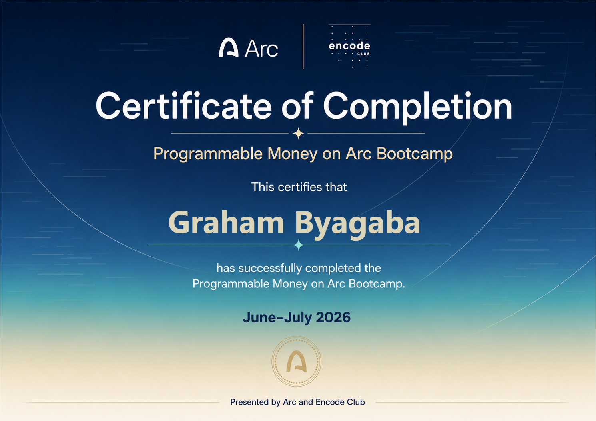

# Arc Legacy 🏛️

**Stablecoin-native estate planning — with an autonomous treasury agent — on [Arc](https://docs.arc.io)**, Circle's USDC-native L1 where USDC *is* the gas token.

Built for the **Build on Arc** hackathon, entered in **both** tracks with one project:
**DeFi** (inheritance, yield, programmable payments, FX) and the **Agentic Economy** (an autonomous agent that holds its own wallet and transacts in USDC with no human in the loop).

**Live app:** https://arc-legacy-eight.vercel.app

### Deployed on Arc testnet (chain `5042002`)

| Contract | Address | Purpose |
|---|---|---|
| **ArcLegacyV2** — estate vault | [`0x2b56…C277`](https://testnet.arcscan.app/address/0x2b56a883c95B8809BE663E01F18af08b37AbC277) | Inheritance vault: deposits, heirs, dead-man's-switch, linear vesting, M-of-N guardians |
| **ArcYieldVault** | [`0xb5b5…8761`](https://testnet.arcscan.app/address/0xb5b5CE9C1bD85A68B4fE2F0274d419bE1a3f8761) | Real 5% APY native-USDC savings vault, interest paid from a funded reserve |
| **PaymentRouter** | [`0x3a21…0630`](https://testnet.arcscan.app/address/0x3a210EF428ce1aF1549F0BcF60DA8B608C200630) | Programmable USDC payments: atomic fee-split + conditional escrow |
| **LegacyStreams** ⭐ *new* | [`0xBdbD…2b2a`](https://testnet.arcscan.app/address/0xBdbD5Cf3D05735Fe526c8Df58FB978C8915d2b2a) | Recurring USDC payments: DCA estate contributions + scheduled heir annuities, settled by the autonomous keeper |

---

## The idea

Billions in crypto are lost forever when holders die or lose access — a wallet has no "next of kin." Arc Legacy is on-chain estate planning that settles itself:

1. **Create an estate** — deposit USDC into your vault.
2. **Name your heirs** — assign each a share in basis points (must sum to 100%).
3. **Stay alive** — check in before your dead-man's-switch deadline (default 30 days, configurable). Any deposit, withdrawal, or settings change also counts as a check-in.
4. **Legacy executes itself** — miss the deadline (or have your guardians attest) and the estate unlocks; each heir claims their share directly. No custodian, no probate, sub-second settlement in USDC.

**v2 adds:** **linear vesting** (stream an heir's share over N days instead of a lump sum) and **M-of-N guardians** (a threshold of trusted guardians can unlock early — any proof-of-life by the owner voids pending attestations).

## Two tracks, one project

### 💸 DeFi
- **Inheritance vault** with vesting + guardian social-recovery (`ArcLegacyV2`).
- **Real on-chain yield** — a 5% APY native-USDC vault (`ArcYieldVault`), *honest by construction*: interest is only ever paid from a separately-funded reserve, and the contract enforces `balance ≥ totalPrincipal`, so one supplier's principal can never fund another's interest.
- **Programmable payments** — `payAndSplit` (atomic merchant + fee) and escrow (`open → release | refund`) for conditional, multi-step settlement (`PaymentRouter`).
- **Circle App Kit suite** — Send, Swap, **StableFX** (locked-rate USDC⇄EURC), **Bridge via CCTP**, and Unified Balance, each surfacing a real Arcscan tx hash.
- **USDC gas meter** — lifetime gas spend shown in dollars, because on Arc gas is USDC.

### 🤖 Agentic Economy
- **An autonomous agent keeper** (`agent/keeper.js`) that holds its **own wallet** and, each cycle with no human in the loop: runs **proof-of-life** (`checkIn`), **sweeps idle USDC** into the yield vault (`supply`), and **claims accrued interest**. Because Arc's gas token *is* USDC, every action both moves USDC and pays its fee in USDC — a fully stablecoin-native agent. See [`agent/README.md`](agent/README.md).

## Why Arc

- **USDC as native gas** — heirs receive real dollars, not a volatile token, and pay fees in the same asset they inherit.
- **Sub-second finality** — claims and agent actions settle instantly.
- **Predictable, dollar-denominated fees** — suited to a product for non-crypto-native families and to an always-on agent.

## Architecture

| Path | Purpose |
|---|---|
| `contracts/ArcLegacyV2.sol` | Estate vault (deployed): deposits, heirs, check-ins, vesting, guardians, claims |
| `contracts/ArcYieldVault.sol` | Real 5% APY native-USDC savings vault |
| `contracts/PaymentRouter.sol` | Atomic fee-split payments + conditional escrow |
| `contracts/LegacyStreams.sol` | Recurring native-USDC payments (DCA contributions + heir annuities) |
| `contracts/ArcLegacy.sol` | v1 estate vault (superseded by v2) |
| `test/*.test.js` | Unit test suites — **64 passing** (Hardhat + ethers v6) |
| `scripts/deploy*.js` | Deploy scripts for each contract |
| `web/` | Frontend: Vite + React + TypeScript + ethers v6 + Circle App Kit |
| `web/api/rpc.js` | Same-origin JSON-RPC proxy (see Technical notes) |
| `agent/keeper.js` | Autonomous agent keeper (Node + ethers) |

## Getting started

```bash
npm install
npx hardhat test            # 64 passing
```

### Run the web app

```bash
cd web
npm install
cp .env.example .env        # set VITE_CONTRACT_ADDRESS / VITE_YIELD_VAULT / VITE_PAYMENT_ROUTER
npm run dev                 # http://localhost:5173
```

### Run the autonomous agent

```bash
cp .env.example .env        # set AGENT_PRIVATE_KEY (the agent's own wallet)
node agent/keeper.js --dry-run   # read state, print decisions, send nothing
node agent/keeper.js --once      # run one autonomous cycle for real
```

Full details and config knobs: [`agent/README.md`](agent/README.md).

### Deploy to Arc testnet

1. Set `PRIVATE_KEY` in `.env` and fund it with testnet USDC at https://faucet.circle.com (select Arc Testnet).
2. Deploy any contract:

```bash
npx hardhat run scripts/deployArcLegacyV2.js --network arcTestnet
npx hardhat run scripts/deployYieldVault.js --network arcTestnet
npx hardhat run scripts/deployPaymentRouter.js --network arcTestnet
npx hardhat run scripts/deployLegacyStreams.js --network arcTestnet
```

After deploying LegacyStreams, set `VITE_STREAMS_ADDRESS` (web) and
`STREAMS_ADDRESS` (keeper) so the Recurring widget and the keeper's scheduled-
payments action activate.

### Arc testnet details

| | |
|---|---|
| Chain ID | `5042002` |
| RPC | `https://rpc.testnet.arc.network` |
| Gas token | USDC (18 decimals at EVM level) |
| Explorer | https://testnet.arcscan.app |
| Faucet | https://faucet.circle.com |

## Technical notes

- **Same-origin RPC proxy.** The public Arc RPC (behind Cloudflare) returns no CORS headers, so a browser's cross-origin JSON-RPC POST is blocked ("Failed to fetch"). `web/api/rpc.js` forwards reads server-side so the app can read chain state; writes go through the injected wallet and are unaffected. Node code (the keeper) hits the RPC directly.
- **Rate-limit resilience.** The public RPC rate-limits hard, so all reads share one batched provider with retries and in-flight de-duplication (`web/src/lib/chain.ts`).
- **App Kit tx-hash capture.** `web/src/lib/txhash.ts` robustly extracts a real tx hash from any App Kit result shape, so every live action leaves a verifiable Arcscan link.

## Certifications



*Programmable Money on Arc Bootcamp* — Certificate of Completion, Arc × Encode Club (June–July 2026).

## Roadmap (hackathon checkpoints)

- [x] **Checkpoint 1 (Jul 19)** — idea, team, project page
- [x] **Checkpoint 2 (Jul 26)** — core contract on Arc testnet, repo public, web UI started
- [x] **DeFi track** — vault (vesting + guardians), real yield vault, payments/escrow, App Kit swap/FX/bridge, gas meter
- [x] **Agentic Economy track** — autonomous keeper holding its own wallet, transacting in USDC
- [ ] **Checkpoint 3 (Aug 9)** — final MVP, 3-min demo video, deck
- [ ] Stretch: check-in reminders, EURC-denominated estates, Circle Programmable Wallet identity for the agent
